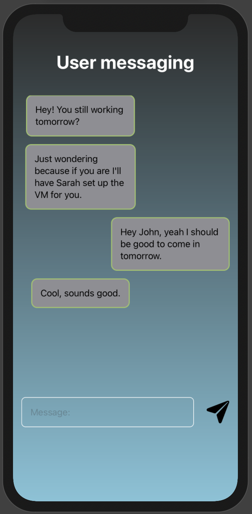
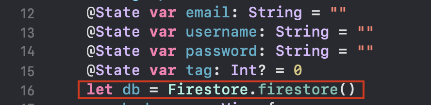
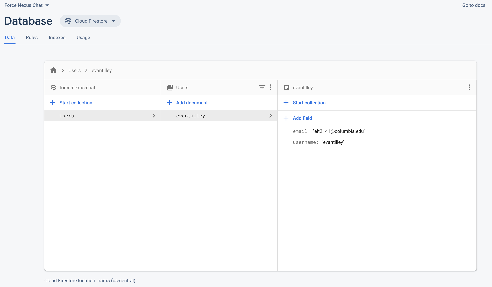

ForceNexusChat

### Goal
Create a real-time iOS chat application.
### Tech Stack
Swift, SwiftUI, Firebase, CocoaPods

## Getting Started
### Open Xcode and create a new project
Note: Ensure that you have Xcode v11 or higher, and you have macOS 10.15, since we are using the latest Apple framework for creating iOS applications, SwiftUI.  

### Select 'iOS' and 'App' and press Next

### Give your application a Product Name
You may have to create a 'Team' using your iCloud account. For your organiziation identifier, you can put something like 'com.lastnamefirstname'
##### Make sure that 'SwiftUI' is checked

Press 'Next' and save wherever

### Your new project!

The resulting file should looking something like this

## Some history

### UIKit

The primary framework for developing iOS applications has always been (and some would argue still is) UIKit. It's been around for over 10 years and most apps currently on the App Store were created with UIKit. UIKit was focused on using storyboard to segue between different views. 

This worked fine, but there were a few issues such as:

* Difficulties managing the state of the application and keeping the UI updated as the state changes
* Difficulties passing custom objects from one view to another
* Creating and testing the user interface was tedious as the application had to be run on the simulator every time
* Scaling the application to different devices was difficult

### SwiftUI

At Apple's Worldwide Developer's Conference in 2019, SwiftUI was unveiled. It's a new framework for creating application that makes the process of coding and designing arguably faster and more convenient. The main issue with SwiftUI at the moment is there is less support/libraries for it since it's still relatively new. There are also strange bugs here and there, but over the last year Apple has improved the capabilities of their new framework and it will eventually become the new standard as larger companies begin refactoring their applications in SwiftUI.

#### Views

Rather than having a bunch of different storyboards, SwiftUI focuses on having various views in an application. This allows for a lot of cool features including:

* Live previews
* Highly reactive UI
* Nice ways of modeling views
* Declarative programming
* Easier to scale to different devices

## Workshop Part 1 - Front end

From here on, most of this will be code + images of the resulting views. In the workshop, the code will be explained/expanded upon.

### Creating a login page

Every chat app needs a login page. Let's create the login page together. Afterwards, groups can split off and create their own sign up pages.

To start off with, Xcode gives you somthing like this:

which creates the following preview in the **canvas** (I'm using an iPhone 11 for this example)

##### Adding background/buttons/images

We'll go through how to create a loginPage that resembles the following:

Note that the placeholder text is difficult to see - there is a way around this that involves creating a custom textfield struct. If interested, let me know.

All the relevant code for this page is in Part1/loginView.swift

### Activity #1 - Recreating a Signup Page

We now need to create the sign up page. To get started creating a new view, create a new SwiftUI view. Go to File -> New -> File, or press command(⌘) and N.

Select a SwiftUI View as the type of your new file and press 'Next':

Call your new view "SignUpView" and **make sure it is saved under the ForceNexusChat folder and the ForceNexusChat group** with the ForceNexusChat target selected.

Press 'Create' and you should see your new file!

At this point, those running Xcode can break out with groups and create their own version of a sign up page. The sign up page should include:

* A textfield to enter email
* A textfield to enter username
* A textfield to enter password
* A button to sign up

You can use this as a guide:

**This exercise should take about 30 minutes** since it mostly just involves copying and pasting and then adding whatever other fancy UI/features you'd like. The forcenexus.us image is under Part1/forcenexus.png

The next exercise will require implementing your own UI mostly from scratch.

//next: create barebone foreach loop with no background and stuff and tell them to customize it themselves

### Creating the main page

We now need to create the main page. We'll create a very basic main page together that demonstrates how to work with showing a list of users in a view, and then any groups can split off and create their own customized main page.

Create a new view, exactly as you did for the SignUpView and call it "MainView"

We'll now create a basic user interface which takes a list of users and displays the list on the screen. Ideally by the end of this workshop, clicking on each user will bring you to your conversation with that user.

#### Basic Setup

Below is the code for the basic setup. We're creating an array of users and displaying them all on the view. Note that changing the contents of the users array will update the view accordingly. The ScrollView allows us to scroll through the list of users and we can change the height of the ScrollView depending on the value of .frame(height: ) that we pass in. Feel free to change yours to suit your design.

This code is also available in the file /Part1/initialMainView.swift.

The resulting screen looks something like this:

### Activity #2 - Creating your own main view page

Those with Xcode can now split off into groups and create their own version of the main page! Try adding a few pictures, a nice background, and a much neater list! Think about what you'd what the main page of a Force Nexus chat application to look like. This activity should take about 1 hour.

#### Sample Main View Page:

(revealed after activity is over)

I came up with something like this:

The code for this can be found in Part1/UpdatedMainView.swift

### Creating each individual message item

SwiftUI is convenient because it allows you to easily implement custom objects.

Let's create a "MessageItem" class. We'll make it relatively simple (no read receipts, delete functionality, etc.) Some data our message class should have is:

* Message Content
* Message Receiver
* Message Sender
* Date sent

Create a new file, and this time make sure it is a plain **swift** file, NOT a SwiftUI view:

You can call it something like "MessageItem.swift"

Note that the variable date of type "Date" will later be changed to type **Timestamp** once we set up our database. We don't have to worry about it too much for now.

Now, let's create a view for **each** message item. What's so nice about SwiftUI is that we can essentially create a view where the information for the view comes in a format based on the struct we just created. Once we create the view for each indiviudal message item, we can create another view with a ForEach() loop that contains a bunch of MessageItems!

Create a new Swift UI view called "MessageItemView". Make sure, like your other SwiftUI views, that you create it under **both** the ForceNexusChat folder AND the ForceNexusChat group.

This view will be a bit different from the others, since we want each MessageItem to be relatively small, resembling something like a text message.

We can create something simple like this:

With the following code:

### Creating the Messaging View

We now need to place these MessageItemViews inside of one main Messaging View.

Create a new SwiftUI view named "MessagingView.swift".

We're also going to need to create a struct to represent our user. This will be more useful once we set up our back end with firebase, but for now create a new **plain** swift file, UserModel.swift.

The code inside the file is pretty simple, since all we'll really need is to keep track of the current user logged in:

Now we can code our MessagingView to look something like this:

The code for this can be foud in /Part1/InitialMessagingView.swift

### Linking the views

Using navigation views, we will now link the views to one another.

We're first going to modify the "Sign Up" button in the login view so it sends users to the sign up screen.

Since we're in a NavigationView, we can make use of NavigationLinks. Modify ContentView.swift as follows:

We then need to change the value of the State variable tag to be 1, when the "Sign Up" button is pressed:

And boom, if we run the iPhone simulator and press "Sign Up", we'll be taken to SignUpView.swift.

Since, for design purposes, we removed the navigation bar from the view, let's add a back button to the SignUpView real quick:

Also, be sure to apply the necessary mofidiers (to the overall VStack or ZStack encompassing the view) to prevent the NavigationBar from momentarily flashing when this view is entered:

For actually signing up and logging in, we're going to have to deal with the backend, or part 2 of creating this application.

The code up to this point (i.e. all the front end code) for the application can be found in /Part1/EndResult. Note that, if you are using Xcode 12 Beta, this version introduced a change in the file structure of SwiftUI projects, as Apple prepares to launch iOS 14. Thus, rather than having the files "SceneDelegate.swift" and "AppDelegate.swift", you may have one file "ForceNexusChatApp.swift". Either way is fine for this project, but I am using the older method of SceneDelegate and AppDelegate, since, at the time of writing this guide, this is the predominant file setup for SwiftUI applications.

## Workshop Part 2 - Back end

### Firebase

Firebase is a service provided by Google that, through an intuitive API, allows users to create a backend with a variety of features, including authentication and storage. We are going to use the Firebase authentication system, in combination with Cloud Firestore, a real-time database system offered by Firebase.

We will go through this set up in the workshop, but I'll put some guiding images and instructions here, for the purposes of the walkthrough.

### Firebase setup

Head to firebase.google.com and create a new project. Name it something like "Force Nexus Chat". Press "Continue"

You'll next be asked if you want to use Google Analytics. This is up to you - for this project it might be sensible not to use it since it takes up extra space/adds extra compile time to the application, but in general it is a very useful feature so I'll add it. 

Choose your Google account and press create project. After a few moments, you'll have a brand new Firebase project!

Add an iOS app to your project:

You'll then be asked to enter your iOS bundle ID. You can find this by clicking here on your Xcode project:

Your bundle Identifier is located here, in the "General" tab:

Copy that identifier, and place it in the Bundle ID section of the Firebase iOS setup.

Feel free to put whatever for the App nickname and you can leave the App Store ID blank since this application isn't on the App Store.

Press "Register App" and then download GoogleService-Info.plist. <b>Make sure the file is called EXACTLY GoogleService-Info.plist </b>

Drag and drop the file into your Xcode project, and make sure to add it to the application target, as indicated in the Firebase setup documentation. You should now have a new file in your project, called "GoogleService-Info.plist".

Open up your terminal and navigate into your project directory. You will need to have CocoaPods installed. If you do not, you should be able to run "sudo gem install cocoapods" to install it. 

Make sure you're in the directory with the following files (or the one above it): 

and run "Pod init".

We now need to add 3 pods to our Podfile. Open up your Podfile (easiest way is probably with vim) add 3 pods:

pod 'Firebase/Auth'

pod 'Firebase/Firestore'

pod 'Firebase/Analytics'

Your Podfile should look something like this:

The Podfile is also located in Part2/Podfile

Save the Podfile and run 'pod install' in your terminal. Wait for it to finish installing all necessary pods.

<b>Now close our your xcodeproj file. You will not be using it again. Open up a new file that has been created in the same directory, a .xcworkspace file. All future work will be done in this file.</b>

Upon opening the workspace, the indexing might take a few minutes. Give it a bit to finish processing all the files.

Let's now add some initialization code. Modify your AppDelegate.swift file:

<b>Make sure to include the line 'import Firebase' in this file, and every file in which you are using Firebase functions. </b>

Congrats, at this 

### User Sign Up

Let's now implement the sign up functionality in our sign up page. There are two parts to this. The first is actually the user with Firebase. The second is creating some space in our database for our user once he/she signs up.

Let's start with the first. Go to your Firebase project and select the "Authentication" tab. Select "Set up sign-in method". Select "Email/Password" and enable the first option. Press "Save".

Now, we just need to authenticate a user when they press sign up, and then, if authenticated, make space in the database for them, and then take them to the main chat view.

First, add another navigation link in the sign up view that we can use to take the user to the MainView:

Also, make sure to import the Firebase module innSignUpView.swift.

Let's now set up our Firebase database. Click on the "Database" tab. Press "Create database" under Cloud Firestore.

Choose "start in test mode" so that you will be able to read and write to your database. Press "Next". Then, choose your Cloud Firestore location. I'll go with nam5 (us-central). Press "Done" and give Firebase a few moments to create your database.

Now, let's create a reference to our database in SignUpView.swift.

This variable accesses our Firestore database, and, using it, we can read to and write from our database.

Add the following functionality to the "Sign Up" button, which will happen when the button is clicked:

Run the application on the simulator, go to the Sign Up Page, and fill out some info. Note that if the info causes firebase to throw some errors (common ones are that the password must be 6+ characters and the email must be properly formatted), this error would be printed in the console. For a production application, this error would normally be displayed on the page itself, but, for reasons of time, for now we'll just log it to the console so we can see what's going on. Time permitting, we can add this feature afterwards - just create a Text() view that's linked to a state variable that has the value of the error.

Anyway, we could fill out something like this for the information. For now, I have the password field set to a plain TextField, but later we can change this to a SecureField, so the password is displayed as ****************** rather than as plain text.

Here's a sample sign up:

Press sign up, and you'll be taken to the main view, which still is filled with the sample data from before. Do note that, right now, any fake email could be put in, as long as it conforms to the required Firebase format. In a production application, you could set up a system where a confirmation email is sent to the user, and they must accept it before their account is to created; this would prevent people from signing up with random/made up emails. Also note, that in a production application, we'd have to check to make sure that no users with the username exist. This can be done, but it requires the use of DispatchGroups() in Swift, since Firestore code is async. For the sake of time, we won't worry about this now.

Let's check out the situation in Firebase after pressing "Sign up".

First, navigate to the "Authentication" section of your Firebase project. You'll notice a new entry:

This is a new user created by Firebase authentication. Note that the password is <b>NOT</b> stored here. In fact, we don't have access to the password and it is encrypted. You can use the settings here to reset the user's password or delete them/disable their account.

Now, let's check our database in the "Database" section of our Firebase project. Notice that there is a new entry:

We now have our user in the database and the authentication system! Since the user is in the authentication, we can now log into the application! Let's implement that now.

The code for this sign up page is in Part2/SignUpView.swift

### User Log In

Head to your ContentView.swift and make sure to import Firebase.

First, add the capability to switch to the MainView from the login page. We'll use this when the user is successfully authenticated:

Next, let's attempt to authenticate user when they press the "Log in" button:

Again, in an actual applicaiton, rather than logging the error to the console, we would display the error message to the user. Notice how we're searching through the database to find the user with the same email as the one entered, and setting the username of the current user equal to the corresponding username of that entry.

Now, we can open up the application and try to sign in. Try signing in with some incorrect info and you'll get an error in the console. For instance, if I sign in with "email: elt2141@columbia.edu", "password: 1234567" (the real password is 123456), I get the following error: "**The password is invalid or the user does not have a password.**"

I can sign in with the correct info:

and, upon pressing "Log in", I'm taken to the main view.

Note that in a production applicaition, we could play some loading information while firebase logs us in/signs us up, though these processes (especially the log in one) are relatively quick.

Also note: Firebase does not natively support logging in with usernames, <b>but there is a workaround </b>and, using some firestore manipulations, it is possible. It's a super interesting issue and a bit tedious but you can create an application that supports users logging in with either an email or password, without importing any outside libraries!

The code for this part is in Part2/loginView.swift.

### Displaying Users on the Main View

In our main view, we currently just have dummy data. Let's change this so our Main View shows a list of every user in our database (excluding ourselves). Clicking on any of these users will take us to a messagingView with them.

Make sure to import Firebase into MainView.swift and create the reference to your Firestore databsae (i.e. let db = Firestore.firestore()).

We can add the following code to the very bottom of our ZStack which encompasses our entire view:

Try siging up with another user or two, and notice that, when the MainView appears, every single user in our database, since the ID of each user Document is the username of the user.

## Activity #3

Take 10-15 minutes and, working with the code in the .onAppear{}, get all of the names in the database (except for your) own to appear on the screen, instead of the dummy data. Hint - take advantage of the users State variable; also remember that you have access to the current users's username, through currentUser.username.

Solution (after activity):

Now, try adding a few users to your database by signing up with some more accounts, and you'll see all the users in the database (besides yourself) in the list of users!

For instance, I created the following users in my database:

Thus, when I log in as billclinton, I see the following:

Perfect!

The code for the MainView can be found in Part2/MainView.swift

### Messaging Users

When we click on a username in this list, we want to be taken to the MessaginView(). 

Make the following changes to MainView.swift:

Change each text in the ForEach loop to be a button, that will take you to the messaginView of the users clicked upon:

This works great! But we still have our sample data in the MessagingView, so let's fix that.

We're going to need to sort the messages by Date, so first go back into the MessageItem struct and change the type of date to be Timestamp. Make sure to import Firebase:

<b>Note: you'll likely have to remove the date parameter (remember, it's optional) from your sample MessageItem objects we used in earlier examples to test the views, so the project builds. </b>

Head back to MessagingView. First, let's handle what happens when you send a message. We are going to create a "Messages" collection associated with each user. This collection will have another sub-collection with the name of each uesr you are messaging. Within that collection will be multiple documents, each of which represent a message. The structure will look something like this (https://docs.google.com/drawings/d/1qKu-ye-rYKMQ6Ad-CG7oxck-t3kNUZ0S6gu92Iefb6M/edit):

<b>Note that, in Firestore you cannot have a collection nested directly inside another collection, so we must create a "messages" document as a segue</b>

Let's now create this structure, which we can do when the send message button is pressed. Add the following code to the message send button:

This creates a structure like the one in the image above. Test it out by sending a few messages back and forth between uses and checking our your Firestore database. 

We now just need to read back the messages from this structure into our messages array. We will use a Firebase snapshot listener, for real-time updates. We can do this on an .onAppear{} modifier on the ZStack encompassing the MessagingView. We only care about the messages in <b>our</b> side of the database. Add this code into your .onAppear{} modifier:

Run the app, and boom! <b>We have a fully functioning messaging app. </b> 

### Cleaning up a few things

Be sure to go around your views and, to prevent any glitches with the navigation bars, add this code:

to the encompassing structures (i.e. ZStacks and VStacks) of the views. If you add these modifiers to the outermost structures (yes, sometimes to both the ZStack and VStack), it will prevent glitches with the navigation bar briefly flashing/messing up the view. 

I'll leave it up to you to add a back button to the MessagingView - it's exactly the same concept as what we did when we moved from the sign up view back to the sign in view.

## Some Notes

This application, while simple, showcases the essential parts of firebase and thus is a useful template for creating other apps involving communication between users. A few things that we left out were:

* The ability to log out
  * This can be achieved with the Firebase authentication system
* The ability to remember when a user was logged in when they close the application and open it up again
  * This can be achieved with iOS User Defaults
* Push notifications
  * This is more difficult, but it can be achieved. I prefer OneSignal for this, thought the initial set up is a bit time consuming
* Error message UI
  * We just logged errors to the console, but in a real application, we'd have a State error message variable linked up to a Text view that indicates any errors to users.

* Adding an icon to our application.

  * This can be done in the 'Assets' section of Xcode. The dimensions/scaling is a bit tedious but it is satisfying to have an icon for your app.

  <b>The code for the final application can be found in Part2/EndResult </b>

Hope you enjoyed this dive into SwiftUI and Firebase :)

